---
tags:
  - Infrastructure
  - Hardware
  - IT-Rack
  - Server
  - HP EliteDesk
  - Underlay
  - PDU
  - Network components
---
# IT Procurement - Physical Infrastructure

| Attribute  | Details       |
| :--------- | :------------ |
| **Date** | 2026-06-26    |
| **Author** | Linus Bachert |

---

## Context & Problem Statement

**`Problem:`**
:   To transition from theoretical cloud and security concepts to applied engineering, a physical infrastructure is required that accurately simulates an enterprise-grade environment within a strictly constrained physical space. Standard consumer hardware setups lack the physical network separation, safety standards, and structural rigor required to demonstrate advanced architectural concepts.

**`Goals:`**
:   - Design and build an "Enterprise Homelab" in a compact 10-inch form factor.
    - Serve as a tangible, high-quality portfolio piece demonstrating senior-level capabilities in GitOps, Cloud Security Posture Management, and Governance, Risk & Compliance (GRC).
    - Reflect principles of Zero-Trust and strict physical/logical separation (Underlay vs. Overlay) while maintaining a clean, highly professional aesthetic.

**`Constraints:`**
:   - **Spatial Limitations:** Strict spatial limitations within a 9U, 10-inch enclosure requiring precise cable routing and thermal management.
    - **Mobility & Transit:** The infrastructure must be structurally resilient against shearing forces during physical transport (automotive transit) without risk of component dislocation.
    - **Budget & Safety:** Budget optimization without compromising on 24/7 operational safety and fire prevention.
    - **Hardware Availability:** Dependency on custom or 3D-printed mounting solutions due to a lack of standard 10-inch enterprise hardware.

---

## Decision

### Active Compute & Network Fabric

-   :lucide-cpu:{ .lg .middle } __Compute Nodes (Hypervisor & Control Plane)__

    ---

    | Image | Item Name | Specs / Manufacturer | Price | Product Link |
    | :--- | :--- | :--- | :--- | :--- |
    |  | **HP EliteDesk 805 G6 Mini** | Ryzen 5 Pro 4650G, 16GB RAM, 256GB SSD | €299.99 | [Link](https://www.ram-koenig.de/hp-elitedesk-805-g6-mini-pc-ryzen5-pro-4650g-3e4b8us-nowifi/3089) |
    |  | **HP EliteDesk 800 G6 Mini** | Intel Core i5-10500T, 32GB RAM, No SSD | €411.90 | [Link](https://greendot.it/HP-EliteDesk-800-G6-mini) |
    |  | **Raspberry Pi 5 (8GB)** | Broadcom BCM2712, 8GB RAM | €94.90 | [Link](https://www.welectron.com/Raspberry-Pi-5-8-GB-RAM) |
    |  | **Raspberry Pi 5 (4GB) (Qty: 2)** | Broadcom BCM2712, 4GB RAM | 2x €69.90 | [Link](https://www.welectron.com/Raspberry-Pi-5-4-GB-RAM) |

    **Decision Rationale - Compute Tier**

    * **Control Plane Homogeneity:** The three Raspberry Pi 5 nodes form a dedicated, physical, bare-metal Control Plane running Talos Linux. This guarantees a true etcd quorum (3 separate failure domains) and avoids x86/ARM architecture symmetry issues during raft state synchronization.
    * **Worker Nodes (x86_64 Compute):** The HP EliteDesk nodes function strictly as the Proxmox VE virtualization underlay, hosting powerful x86_64 worker VMs. This separates management infrastructure from raw compute workloads.
    * **Multi-Arch Environment:** This deliberate multi-architecture approach (ARM64 Control Plane + x86_64 Worker Plane) provides an enterprise-grade target environment to test multi-arch OCI container pipelines via GitOps.

-   :lucide-hard-drive:{ .lg .middle } __Storage & Persistence (Data Plane)__

    ---

    | Item Name | Manufacturer | Price | Product Link |
    | :--- | :--- | :--- | :--- |
    | 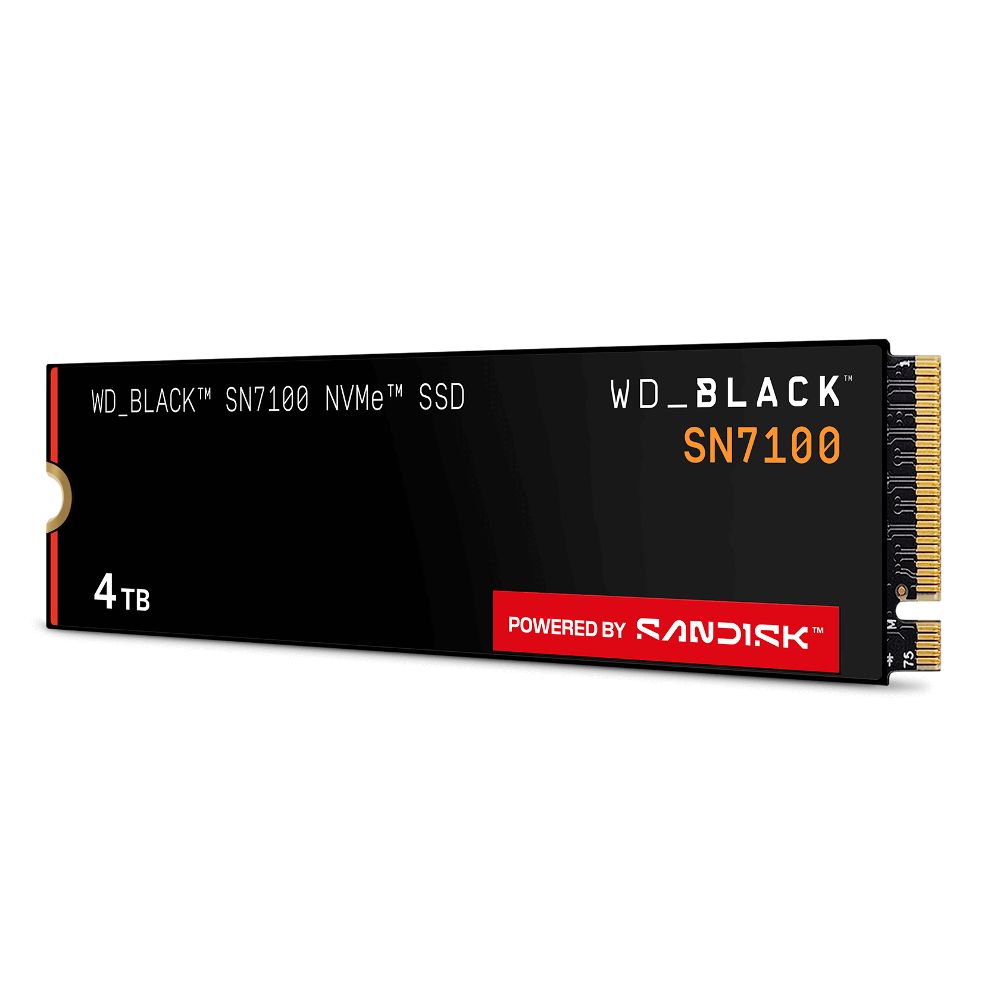 | **2TB NVMe SSD (SN7100) (Qty: 2)** | WD Black | 2x €149.90 | [Link](https://www.cyberport.de/pc-und-zubehoer/festplatten-ssds/ssd-solid-state-disk/wd-black/pdp/3318-06u/wd-black-sn7100-nvme-ssd-2-tb-m-2-2280-pcie-4-0.html) |
    | 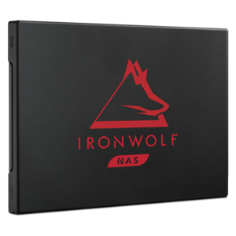 | **1TB NAS SATA SSD** | Seagate IronWolf 125 | ~€89.00 | [Link](https://www.amazon.de/dp/B08H4V2F6K) |
    | 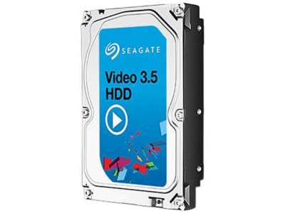 | **2TB HDD (Pipeline 5900rpm)** | Seagate Video | €38.99 | [Link](https://www.amazon.de/dp/B008B0RQ1C) |
    | 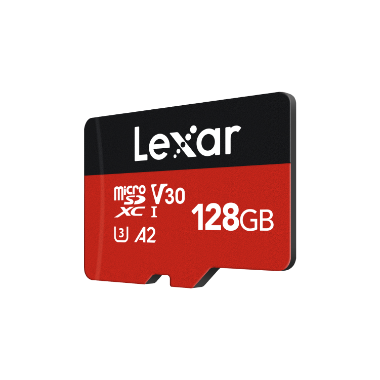 | **128GB MicroSD V30 (Qty: 2)** | Lexar | 2x €23.99 | [Link](https://www.amazon.de/dp/B08XZ7FXGR?ref=ppx_yo2ov_dt_b_fed_asin_title&th=1) |
    | 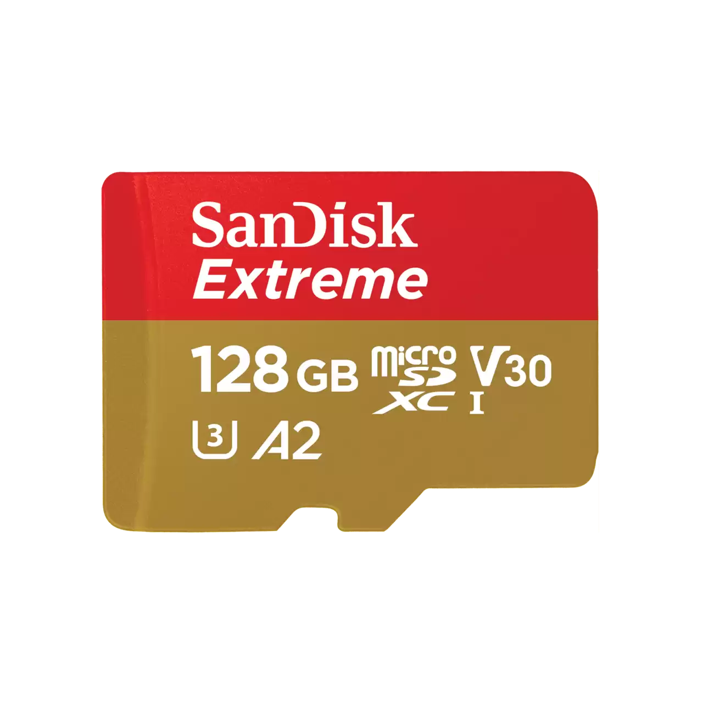 | **128GB MicroSD UHS-I** | SanDisk Extreme | €15.99 | [Link](https://www.amazon.de/dp/B09X7BK27V?ref=ppx_yo2ov_dt_b_fed_asin_title&th=1) |
    | 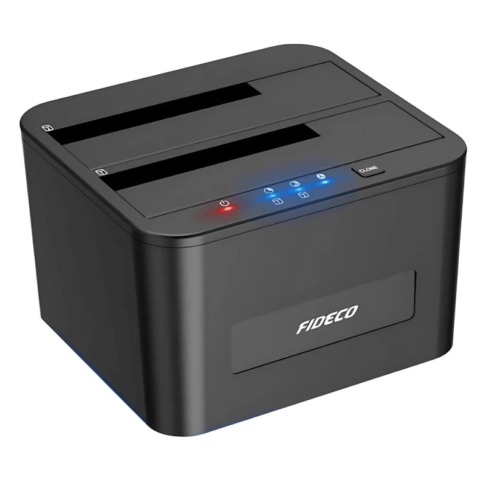 | **Dual SATA Docking Station (USB 3.0)** | FIDECO | €35.19 | [Link](https://www.amazon.de/dp/B07D8S7RN7) |

    **Decision Rationale - Storage Tiering**

    * **Tiering & Connectivity:** The FIDECO dock consolidates the 2.5-inch IronWolf application SSD and the 3.5-inch Seagate Video HDD into a single USB 3.0 controller attached to an HP node. This bypasses the lack of native 12V SATA power lines on Mini-PCs while keeping the architecture compact.
    * **High-Endurance Boot Media:** Since Talos Linux is immutable and runs entirely in-memory (RAM-disk), SD card wear is restricted solely to etcd state persistence. Utilizing high-endurance, video-grade microSD cards maximizes lifespans to 2+ years under constant synchronization.

-   :lucide-network:{ .lg .middle } __Network Fabric & Routing (Underlay)__

    ---

    | Image | Item Name | Manufacturer | Price | Product Link |
    | :--- | :--- | :--- | :--- | :--- |
    | 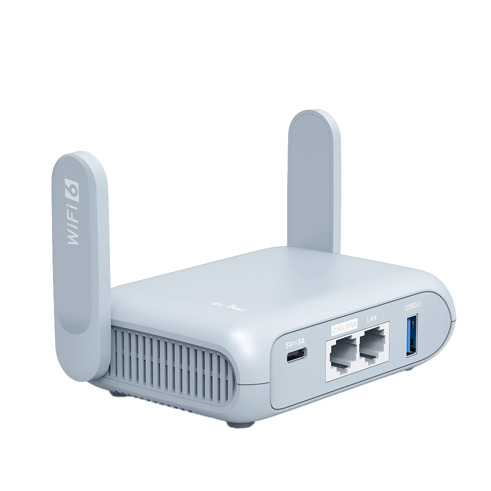 | **Beryl AX (GL-MT3000)** | GL.iNet | €62.39 | [Link](https://www.gl-inet.com/en-de/products/gl-mt3000) |
    |  | **8-Port Gigabit PoE+ Switch (62W)** | Netgear GS308EP | €74.99 | [Link](https://www.amazon.de/dp/B08LZJ2H9S) |

    **Decision Rationale - Network Fabric**

    * **Logical Boundary:** The Beryl AX functions as a strict perimeter gateway, isolating the entire lab via a NAT boundary from external residential networks, while providing secure upstream ingress via WireGuard/OpenVPN.
    * **Layer 2 Segmentation:** The Netgear GS308EP switch serves as the hardware foundation for the Zero-Trust network layer. It enforces strict 802.1Q VLAN trunking and port isolation to cleanly segment the Management Underlay (VLAN 10), Compute Overlay (VLAN 20), and IoT Edge devices (VLAN 30).

### Passive Infrastructure & Housing

-   :lucide-box:{ .lg .middle } __Infrastructure / Housing__

    ---

    | Image | Item Name | Manufacturer | Price | Product Link |
    | :--- | :--- | :--- | :--- | :--- |
    | 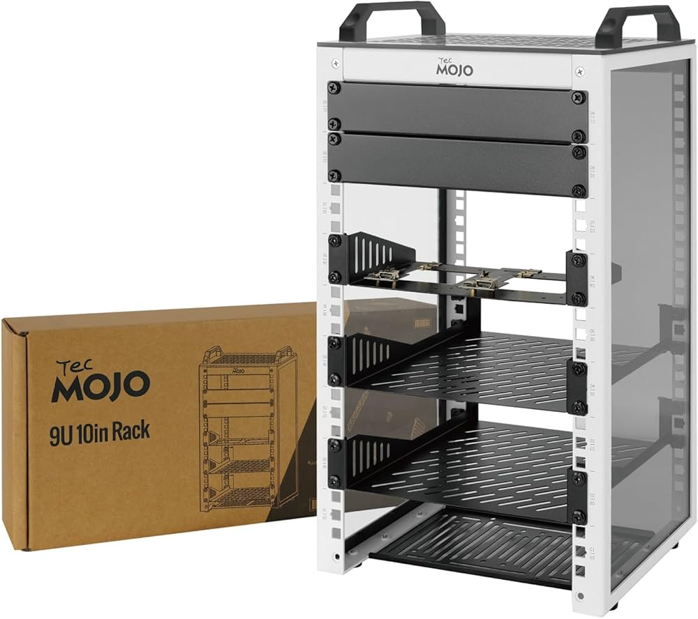 | **10-Inch Rack, 9U, 200mm Depth** | Tecmojo | €89.90 | [Link](https://www.amazon.de/dp/B0GDNP6WX6) |
    | 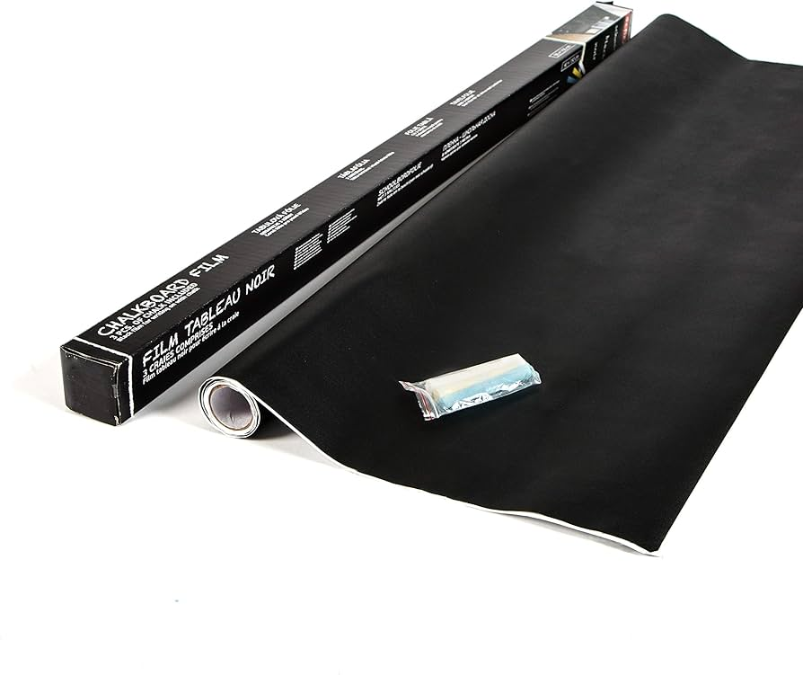 | **Adhesive Vinyl Foil Black (45cm x 2m)** | d-c-fix | €5.95 | [Link](https://www.amazon.de/dp/B005FPTB3W) |

    **Decision Rationale - Form Factor & Stealth Modification**

    * **Tecmojo Enclosure:** The white 9U chassis provides the physical boundaries to mandate tight structural design patterns and forms the baseline for a high-contrast aesthetic.
    * **PDU Stealth Modification:** The silver aluminum finish of the DIGITUS PDU disrupted the matte-black front profiles. Applying a custom-cut d-c-fix matte vinyl layer achieved a flawless factory stealth look without blocking the structural rack ears or overlapping the electrical ground contacts.

-   :lucide-network:{ .lg .middle } __Network Distribution & Connections__

    ---

    | Image | Item Name | Manufacturer | Price | Product Link |
    | :--- | :--- | :--- | :--- | :--- |
    | 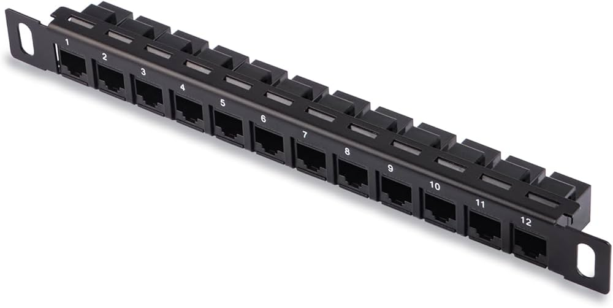 | **12-Port Cat6 Patch Panel – 0.5U** | GeeekPi | €25.99 | [Link](https://www.amazon.de/dp/B0D5Q6CJ1J) |
    | 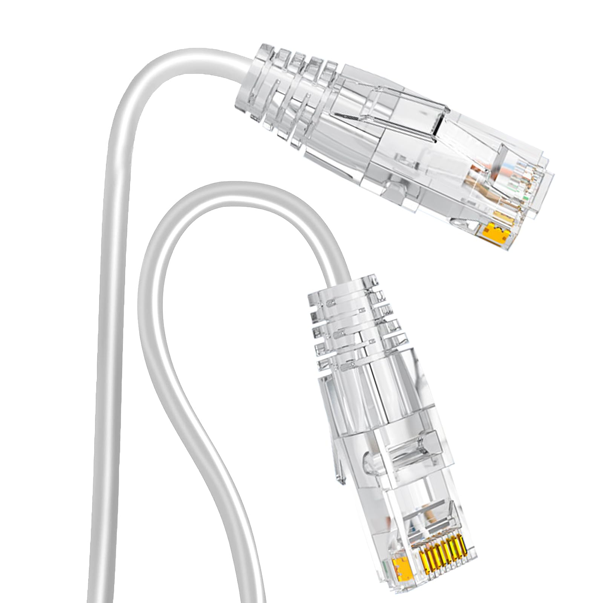 | **White Cat6a Patch Cables (Front, Qty: 10)** | Ercielook | 2x €5.99 | [Link](https://www.amazon.de/dp/B0F8BL9MW2) |
    | 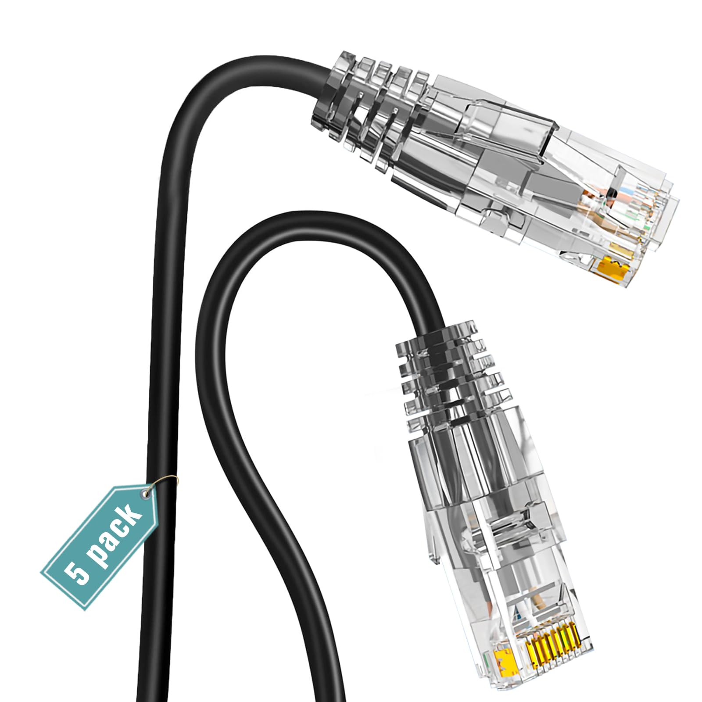 | **Black Cat6a Patch Cables (Rear, Qty: 12)** | Ercielook | €15.46 | [Link](https://www.amazon.de/dp/B0DTY32BZN) |

    **Decision Rationale - Layer 1 Architecture**

    * **Front Waterfall Routing:** The 1-to-1 mapping from Patch Panel to Switch ensures symmetrical routing. Transparent RJ45 boots leverage status LEDs to generate an active fiber-optic lighting effect along the front.
    * **Bend Radii Compliance:** Rigid flat cables were rejected. Round Cat6a copper lines are utilized to maintain a safe bend radius (4x cable diameter), completely eliminating packet-drop risks from structural internal spline warping.
    * **Rear Service Loops:** 1-meter lengths at the rear allow for coiled service loops under the rack roof, providing hardware maintenance slack without disconnecting active nodes.

-   :lucide-paperclip:{ .lg .middle } __Cable Management & Mobile Security__

    ---

    | Image | Item Name | Manufacturer | Price | Product Link |
    | :--- | :--- | :--- | :--- | :--- |
    | 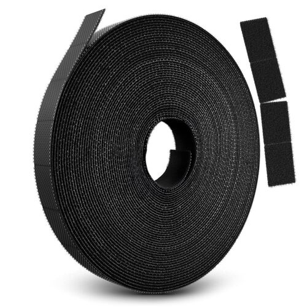 | **Hook and Loop Cable Tie Roll, 10mm** | Gemi | €5.94 | [Link](https://www.amazon.de/dp/B0FH4S1KBX) |
    | 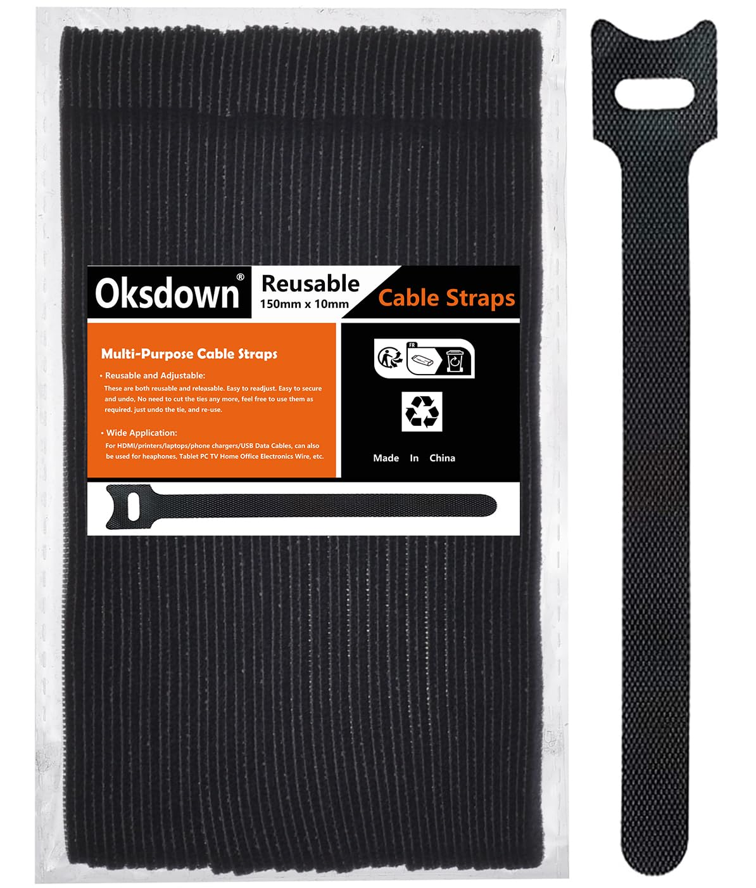 | **Cable Ties Black (50 Pcs)** | Oksdown | €3.99 | [Link](https://www.amazon.de/dp/B092T8N7T3) |

    **Decision Rationale - Slot-Threading Securement**

    * **Dual Use Case:** Beyond strain-relief cable bundling along the vertical rails, the 10mm width was specifically selected to match the stamped ventilation slots of the Tecmojo frame. 
    * By threading the hook-and-loop straps directly through the chassis slits, loose components (Beryl AX, FIDECO Dock) are mechanically locked into place. This "belt-lashing" mechanism completely absorbs lateral shearing forces during transit, rendering the rack transportable.
    * **Nylon Cable Ties (Zip Ties):** Strictly reserved for high-tension anchoring of heavy power conduits (Layer 0) at the rear frame where Velcro might yield under vibration. This strict separation of fastening materials protects data layer integrity while ensuring maximum physical stability for power components during rack transit.

-   :lucide-plug-zap:{ .lg .middle } __Power Supply & Transmission__

    ---

    | Image | Item Name | Manufacturer | Price | Product Link |
    | :--- | :--- | :--- | :--- | :--- |
    | 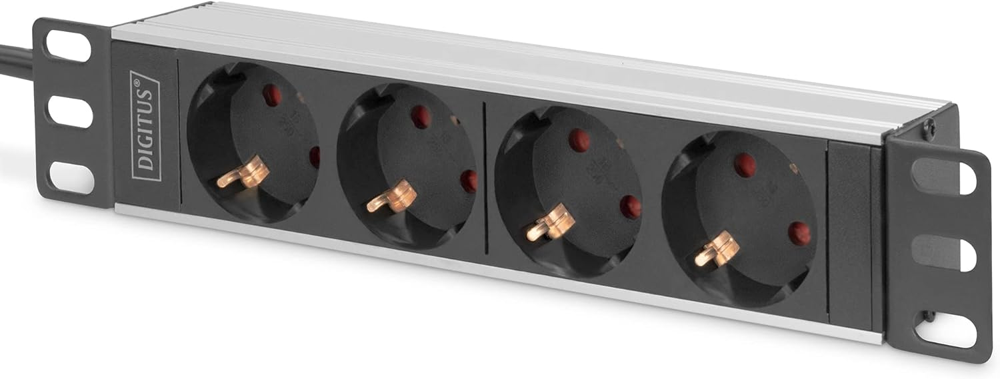 | **4-Way Power Strip (PDU) 1U** | DIGITUS | €15.29 | [Link](https://www.amazon.de/dp/B09M6W23ZM) |
    | 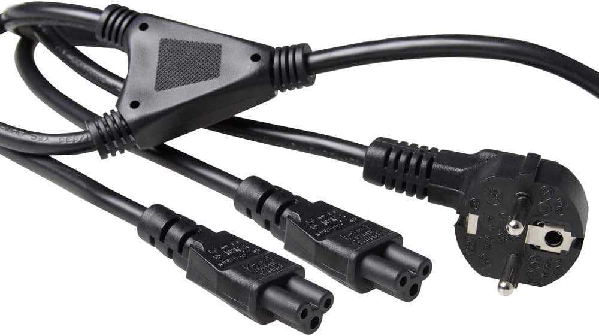 | **Power Cable 3-Pin C5 Y-Cable** | ACT | €16.71 | [Link](https://www.amazon.de/dp/B07SJ6RS4X) |
    | 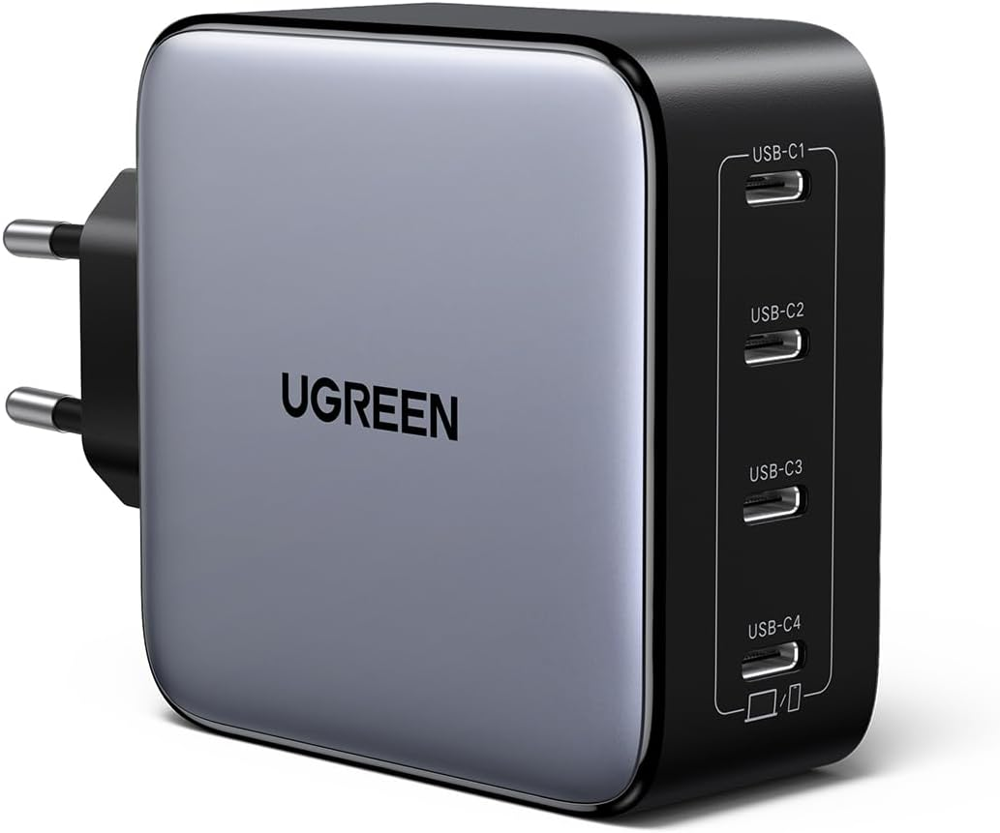 | **100W USB-C GaN Charger (4x Ports)** | UGREEN | €35.98 | [Link](https://www.amazon.de/dp/B0CYT1VVMV) |
    | 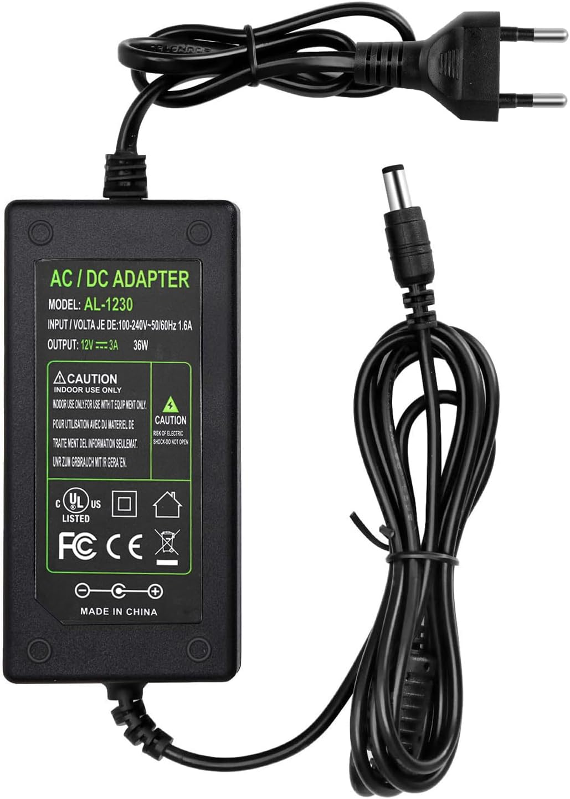 | **12V 3A Power Supply (36W)** | TOBWOLF | €10.19 | [Link](https://www.amazon.de/dp/B07N197JH8) |
    | 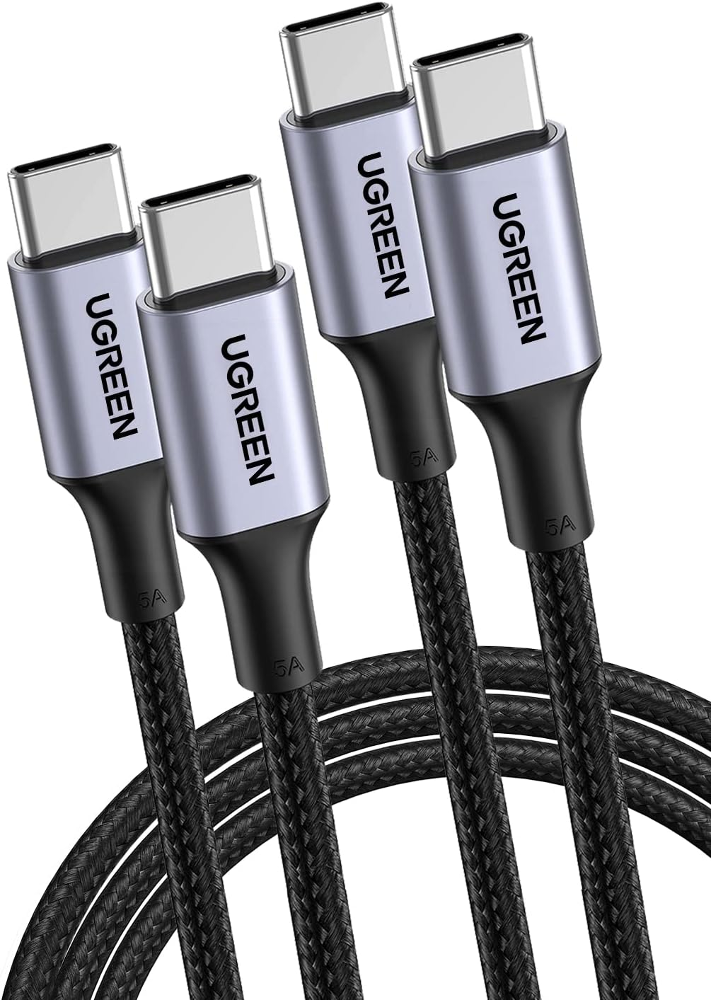 | **100W USB-C Cable (Qty: 4, 1M)** | UGREEN | 2x €10.44 | [Link](https://www.amazon.de/dp/B09N94MZG9) |

    **Decision Rationale - Power Consolidation & Software Overrule**

    * **PDU & Y-Cable Integration:** The ACT Y-cable consolidates the dual HP EliteDesk power bricks into a single Schuko outlet, freeing up critical capacity on the 4-way DIGITUS PDU.
    * **Centralized USB-C Power:** The 4-port UGREEN GaN block supplies all secondary devices. It operates at 95% efficiency, minimizing internal heat output.
    * **The 15W Power Configuration:** The UGREEN charger is capped at 5V/3A (15W) per port, while the Raspberry Pi 5 natively demands a 5V/5A (25W) profile to clear its USB power negotiation. To solve this without adding active hardware converters or untrusted third-party decoy cables, a **Software-Overrule (`usb_max_current_enable=1`)** is injected directly into the bootloader partition. Since the cluster nodes operate purely headless, actual power consumption never exceeds 9-10W under full CPU load, maintaining a safe 5W overhead per node.

-   :lucide-thermometer:{ .lg .middle } __Environmental Monitoring & Passive Thermal Management__

    ---

    | Image | Item Name | Manufacturer | Price | Product Link |
    | :--- | :--- | :--- | :--- | :--- |
    | 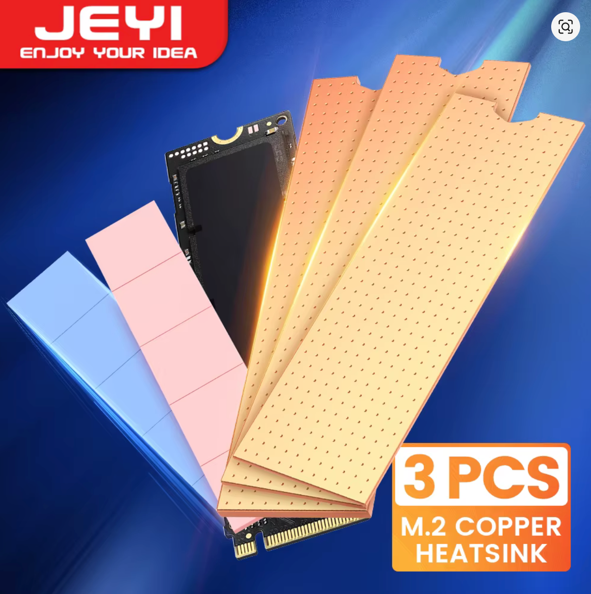 | **Copper M.2 Heatsink (Qty: 2)** | JEYI | €5.10 | [Link](https://de.aliexpress.com/item/1005005713746988.html) |
    | 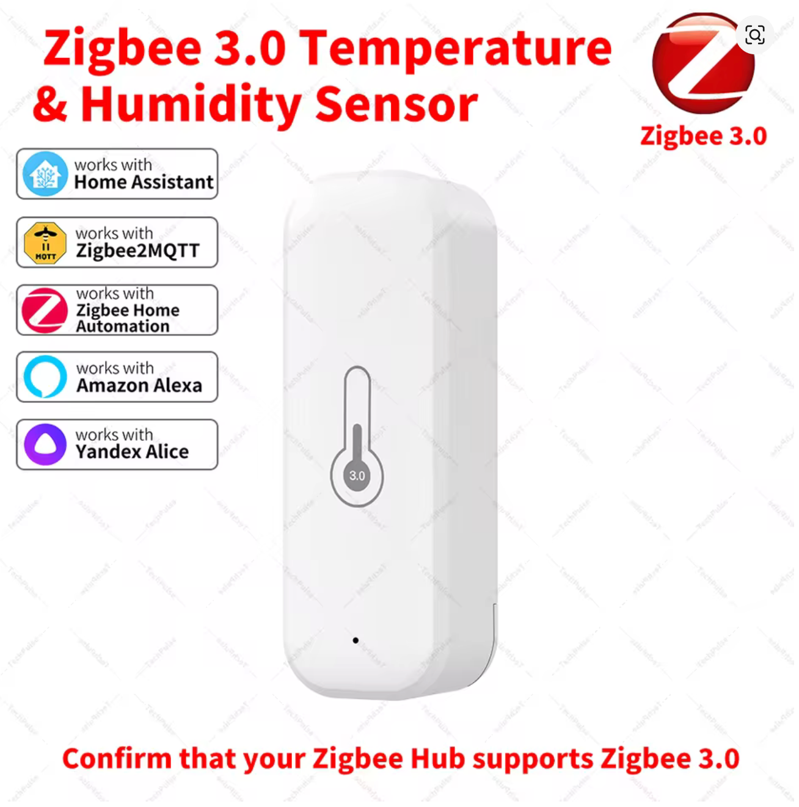 | **Zigbee 3.0 Temp & Humidity Sensor** | Generic | €2.89 | [Link](https://de.aliexpress.com/item/1005011992980900.html) |
    | 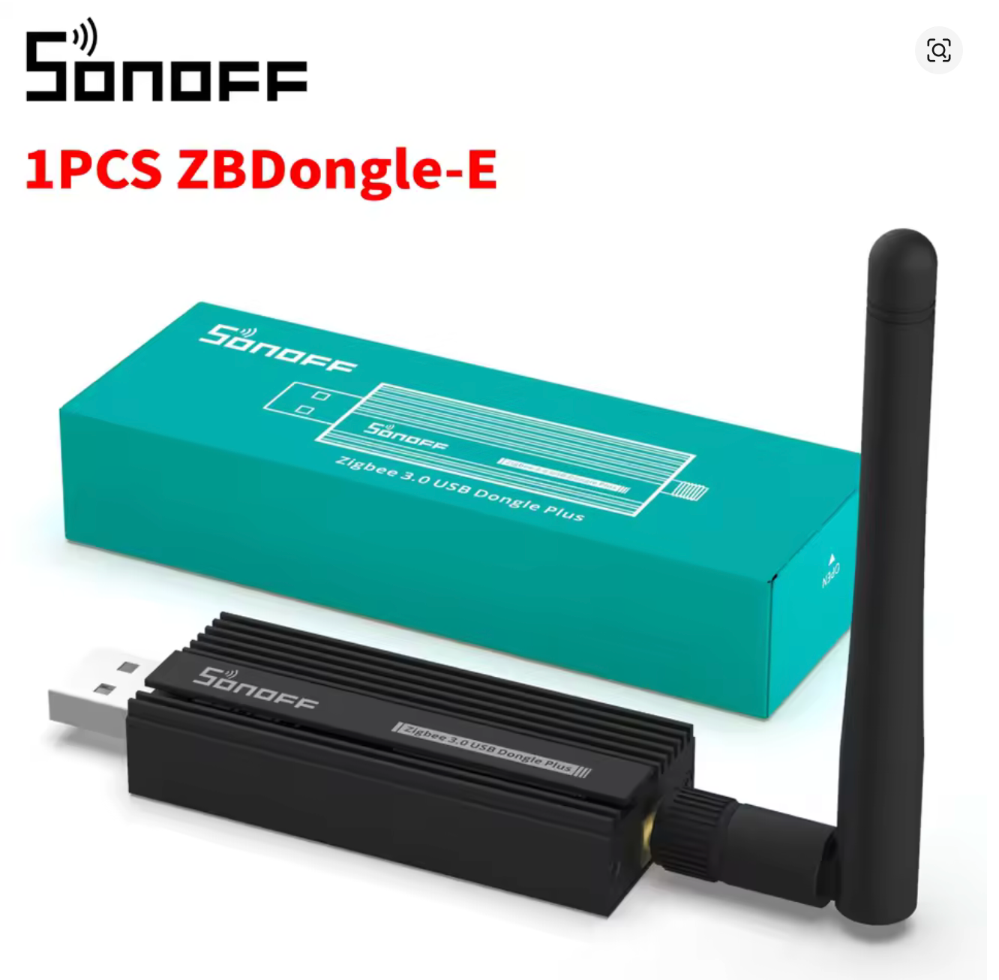 | **ZB Dongle-E USB Dongle** | SONOFF | €15.79 | [Link](https://de.aliexpress.com/item/1005010075573565.html) |

    **Decision Rationale - Thermal Air-Gap Strategy**

    * **Convection Management:** High-density setups suffer from passive heat compounding. The transformation bricks of the external power supplies are laid out on the bottom shelf using custom-rolled hook-and-loop spacers. 
    * These spacers guarantee a structural **1.5 cm vertical air-gap** between each brick. This preserves the internal chimney effect, allowing cool air to pass through the lower ventilation slots and safely carry radiant heat away from the nodes above.
    * **Environmental Metrics:** The SONOFF Zigbee coordinator bridges ambient internal temperatures into the management plane for proactive threshold alerting.

-   :lucide-server:{ .lg .middle } __Mounting & Structural Integrity__

    ---

    | Item Name | Manufacturer | Price | Product Link |
    | :--- | :--- | :--- | :--- |
    | 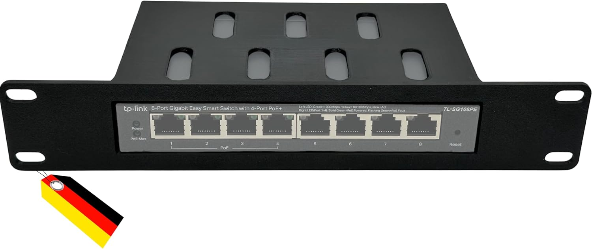 | **Rackmount - Netgear PoE Switch** | N/A (3D Print) | €14.99 | [Link](https://www.amazon.de/dp/B0GMCTB3XJ) |
    | 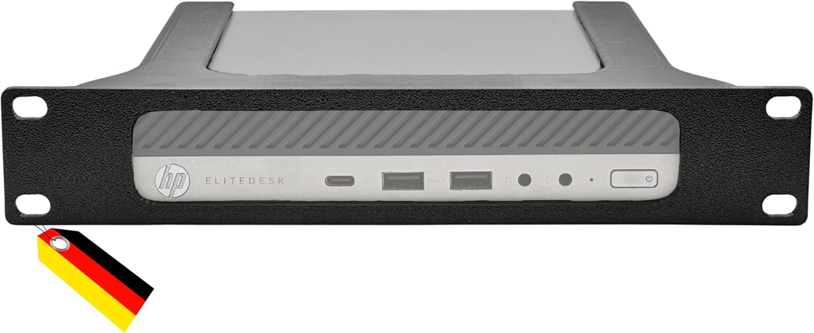 | **Rackmount - HP EliteDesk (Qty: 2)** | N/A (3D Print) | 2x €15.99 | [Link](https://www.amazon.de/dp/B0GCTBXNWX) |
    | 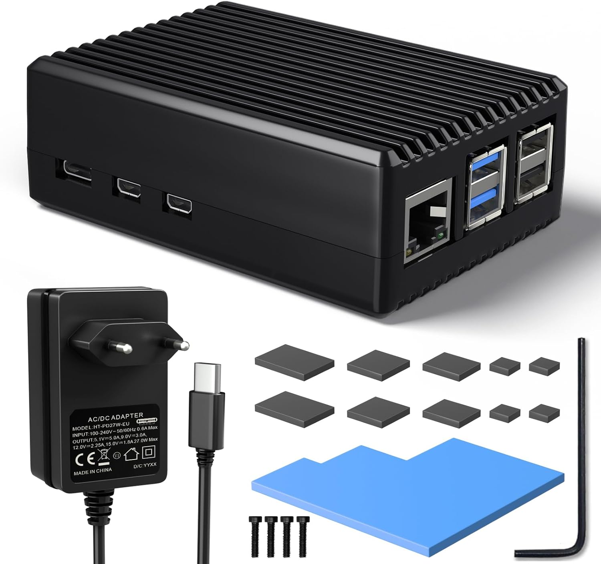 | **Raspberry Pi 5 Case + 27W PSU** | Miuzei | €19.99 | [Link](https://www.amazon.de/dp/B0CRYQFDQP) |

    **Decision Rationale - Symmetry, Stability & Resource Lifecycle**

    * **Precision 3D-Printed Mounts:** Due to the absence of standardized 10-inch enterprise brackets for micro-form-factor nodes, custom mounts are mandatory. They ensure a flush, symmetrical fit across the 8U space. This exact horizontal alignment is the mechanical prerequisite for the tension-free "waterfall" cable routing at the front panel. The rough PEI build-plate texture seamlessly imitates powder-coated industrial steel, preserving the enterprise aesthetic.
    * **Pi Case (Resource Lifecycle Management):** Salvaged from existing older stock inventory. Reusing the heavy-duty aluminum shell provides massive passive cooling thermal mass for the Control Plane nodes without requiring new budget allocation. *(Note: The included 27W PSU is retained purely as an out-of-band backup/testing unit, as primary power is consolidated via the UGREEN GaN architecture to save rack space).*

---

## Consequences & Implications

**`Positive Consequences (Benefits):`**
:   - **Audit-Compliant Security Architecture:** Total separation of the L2/L3 infrastructure. Control plane and hypervisor management networks will be decoupled from the application payload layer.
:   - **Thermal Operational Safety:** The combination of GaN technology, passive copper heatsinks, and a strict air-gap layout eliminates risks of thermal throttling or heat-induced power-supply safety trips during 24/7 cycles.
:   - **Transit Capability:** The physical lashing mechanism allows for uncompromised mobility of the unit for localized auditing demonstrations without teardown requirements.

**`Negative Consequences (Drawbacks/Risks):`**
:   - **PD Renegotiation Drops:** The UGREEN multi-port GaN charger features dynamic Power Delivery (PD) allocation. If one Raspberry Pi is physically plugged in, unplugged, or drastically shifts its power state, the internal controller momentarily drops power to *all* ports to renegotiate the voltage/amperage profiles. This causes unintended hard reboots across the entire Pi cluster control plane.
:   - **Cable Density Constraints:** Managing massive power cords alongside rigid Cat6a cabling on a 10-inch rear frame leaves minimal margin for error. Physical modifications require systematic, layer-by-layer extraction.

**`Technical Debt:`**
:   - **Single Point of Failure (SPOF) for Power:** A failure of the central UGREEN charger completely disables the Kubernetes Control Plane. Future infrastructure refactoring will require deploying PoE+ HATs to transition control-plane power management directly onto individual, monitored switch ports.
:   - **Non-Standard Mounting:** The reliance on 3D-printed PETG/PLA brackets for the HP nodes introduces structural stress vulnerabilities over long-term thermal cycles compared to stamped industrial steel.