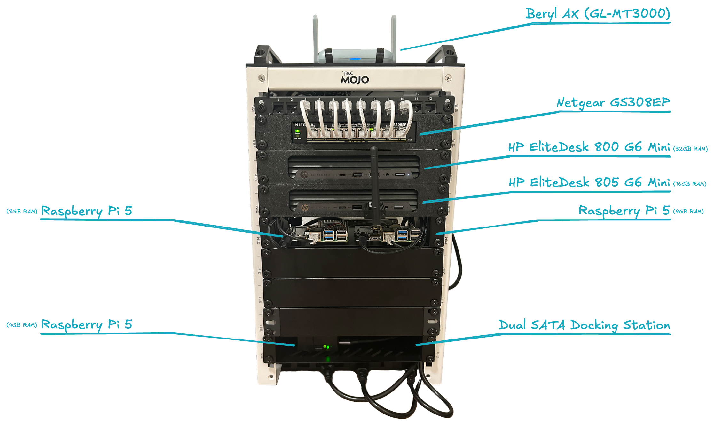
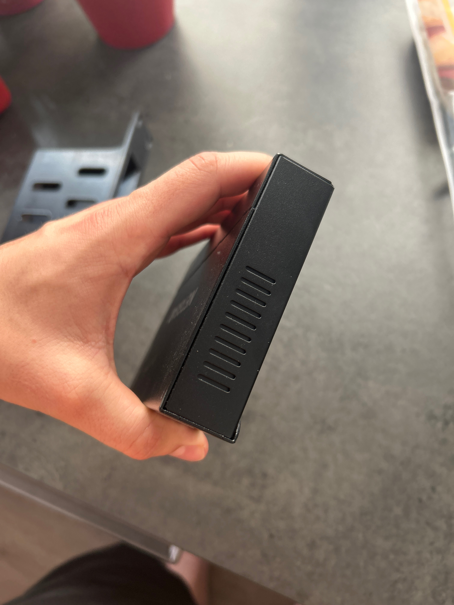
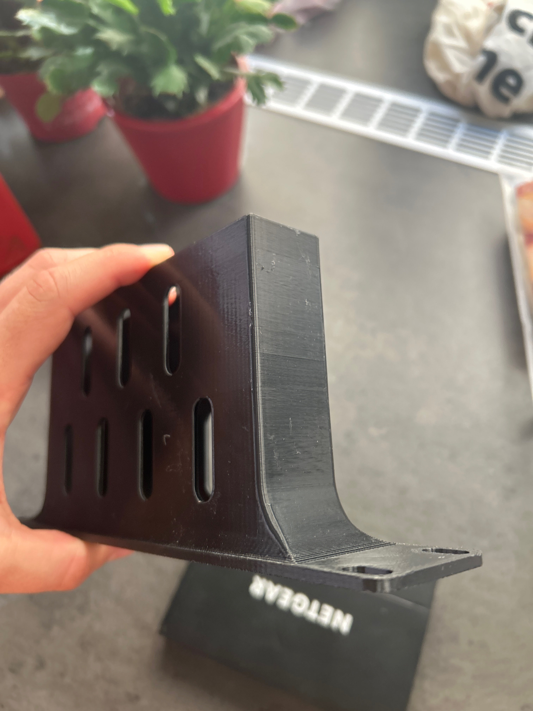
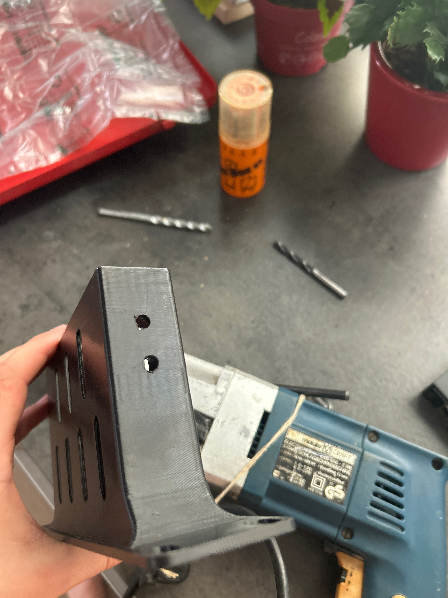
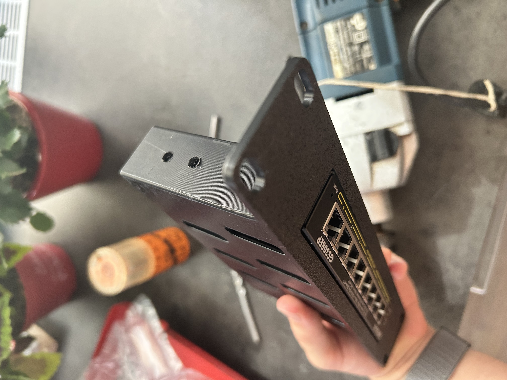
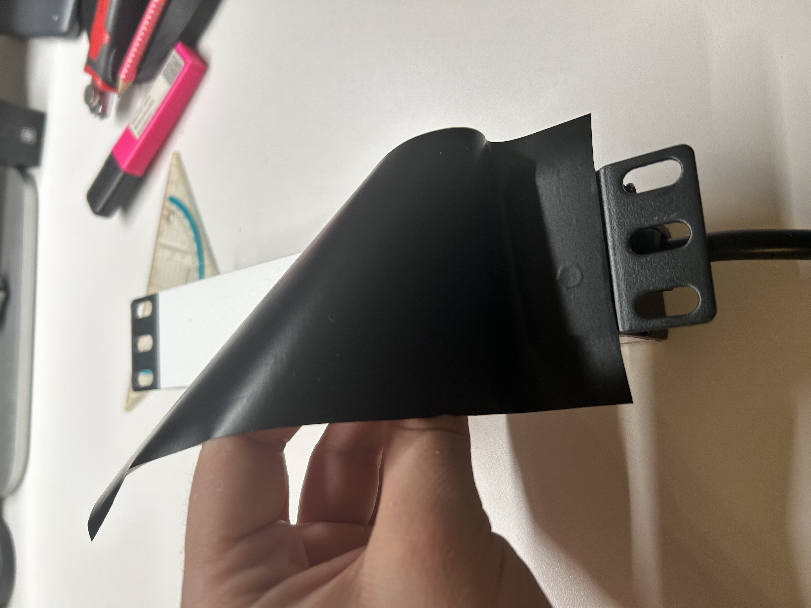
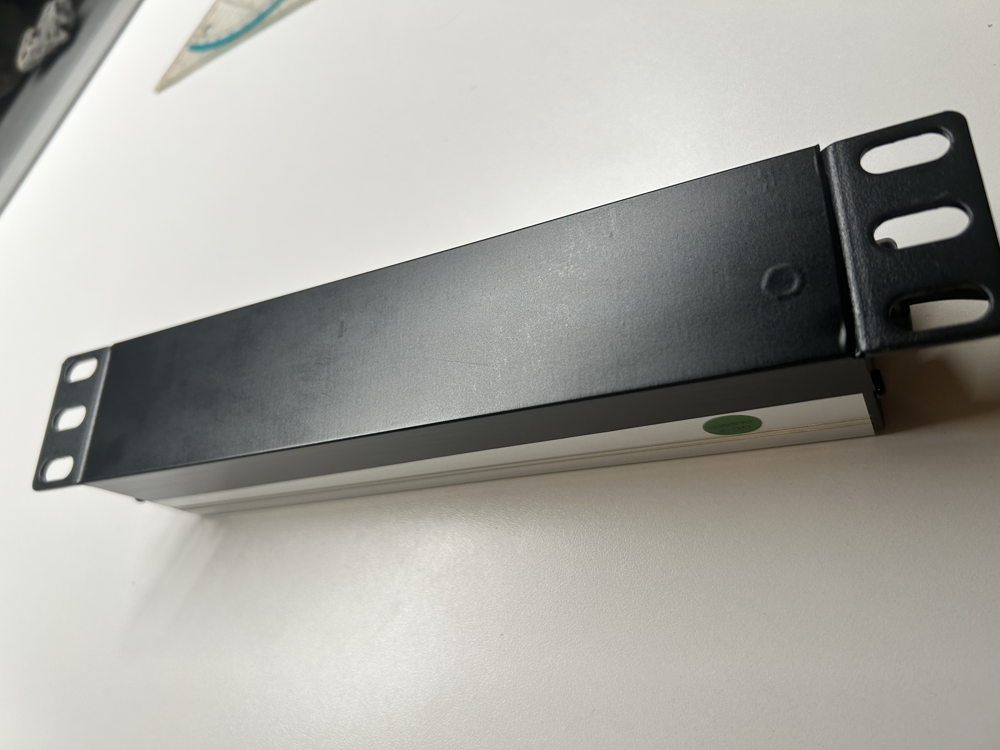
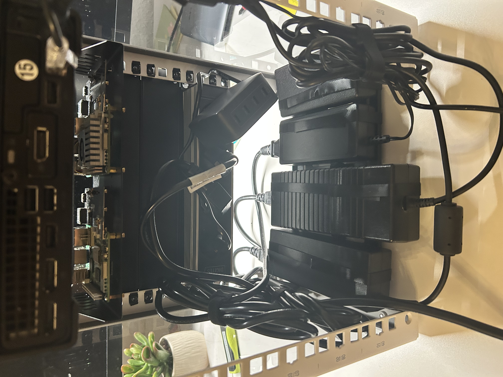
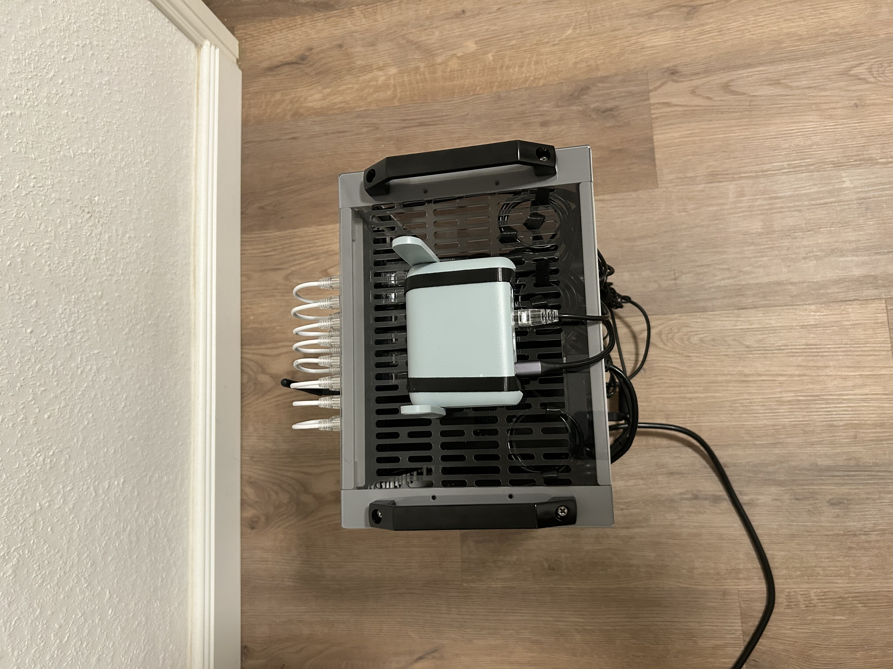
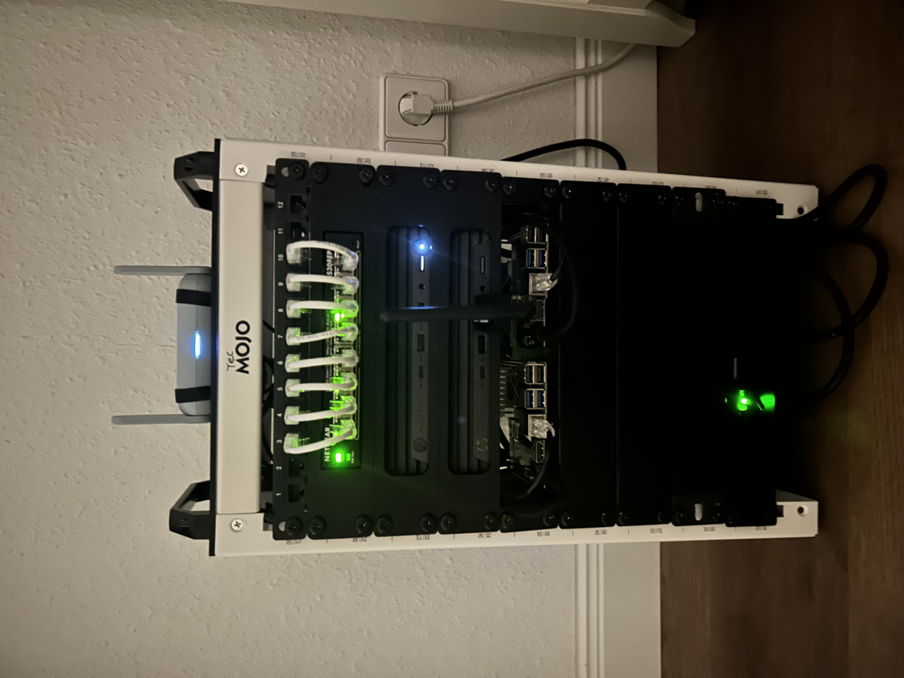

---
tags:
  - Infrastructure
  - Build Log
  - Layer 1
  - Thermal Management
  - Cable Routing
  - Hardware Modifications
---

# Layer 1: Structural Integration & Hardware Modifications

!!! abstract "Executive Summary"
    This document outlines the physical assembly, custom hardware modifications, and structural routing protocols implemented within my 10-inch "Project-Enterprise" Homelab. The objective of this phase was to transform standard consumer and 3D-printed components into a highly resilient, thermally optimized, and strictly compliant Layer 1 datacenter foundation.

{ loading=lazy }
*Fig 1: The fully integrated 9U compute and network infrastructure operating under active load.*

---

## 1. Procurement & Component Audit

-   :lucide-package:{ .lg .middle } __Logistics & Supply Chain__

    ---
    Receipt of initial hardware shipments. Validating packaging integrity to ensure no transit damage occurred to sensitive components prior to deployment.
     
     
     
     
    { loading=lazy }

-   :lucide-layout-template:{ .lg .middle } __Hardware "Knolling" & Inventory__

    ---
    All components were unboxed and subjected to a visual inspection. This knolling process guarantees that all mounting hardware, PDUs, and routing cables are present before initiating the physical rack assembly.
     
     
    { loading=lazy }

---

## 2. Custom Hardware Modifications

Integrating enterprise-grade architecture into a highly constrained 10-inch form factor requires deliberate physical adaptations. Custom 3D-printed brackets often lack the specific thermal tolerances required for high-density mounting.

-   :lucide-thermometer-sun:{ .lg .middle } __Thermal Bottleneck Identification__

    ---
    The Netgear GS308EP PoE+ switch relies on lateral ventilation slots for passive cooling. However, the custom 3D-printed PETG rackmount brackets completely obstructed these crucial exhaust pathways, presenting a severe thermal risk for 24/7 continuous operation.
     
    === "Hardware Specs"
        { width="100%" loading=lazy }
    === "Mounting Flaw"
        { width="100%" loading=lazy }

-   :lucide-hammer:{ .lg .middle } __Precision Chassis Machining__

    ---
    To restore structural airflow, millimeter-precise exhaust ports were manually machined into the PETG brackets using a heavy-duty rotary drill. This modification permanently resolves the thermal bottleneck, ensuring unimpeded lateral heat dissipation.
     
    === "Machined Ports"
        { width="100%" loading=lazy }
    === "Final Integration"
        { width="100%" loading=lazy }

---

## 3. Corporate Identity (CI) & Stealth-Mod

Maintaining a strict, uniform visual identity is a hallmark of professional datacenter environments—and a personal engineering standard I explicitly mandated for this build.

!!! success "The "Stormtrooper" Aesthetic"
    The base design language dictates a high-contrast matte black and white scheme. The original DIGITUS Power Distribution Unit (PDU) featured a highly reflective silver aluminum finish, which aggressively disrupted the visual hierarchy.

-   :lucide-scissors:{ .lg .middle } __Precision Foil Application__

    ---
    Applied a custom-measured, matte black `d-c-fix` vinyl foil directly to the PDU front face. The foil was surgically trimmed around the Schuko sockets to ensure structural grounding contacts remained uncompromised.
     
     
    { loading=lazy }

-   :lucide-check-circle:{ .lg .middle } __Completed Stealth-Mod__

    ---
    The resulting factory-stealth look enforces the Corporate Identity down to the bare metal, perfectly matching the Netgear switch and the custom node brackets.
     
     
     
     
    { loading=lazy }

---

## 4. Initial Chassis Assembly & Data Plane Integration

With the hardware modified, structural integration into the Tecmojo 9U frame commenced. The architecture follows a strict physical hierarchy: Routing logic at the top, Compute in the middle, and Power/Storage at the base.

### Active Power Line Pre-Routing
During the initial seating of the components, active power lines were integrated first. This allowed for precise verification of vertical clearances between the HP Worker nodes and the ARM-based Control Plane, ensuring unobstructed airflow.

{ loading=lazy }

### Persistent Storage Integration
The data plane requires stable, vibration-free mounting. The FIDECO dual docking station was secured at the bottom rear of the rack, housing the Seagate IronWolf NAS SSD and the Seagate 2TB HDD (Pipeline 5900rpm).

{ loading=lazy }
*Fig 2: Seagate IronWolf securely seated in the FIDECO dock, positioned below the two mounted Raspberry Pi.*

---

## 5. Passive Thermal Management Implementation

High-density compute environments suffer from passive heat compounding. When multiple external power transformation bricks are stacked, radiant heat creates thermal pockets that drastically reduce the lifespan of internal capacitors.

!!! tip "Convection Management Protocol"
    To counter this within the constrained bottom shelf, a strict Air-Gap strategy was introduced using custom-fabricated spacers made from hook-and-loop straps.

* **The Chimney Effect:** This technique forces a permanent **1.5 cm vertical air-gap** between all heat-generating units (HP bricks, UGREEN GaN charger). 
* Cool air is drawn from the bottom chassis slits, passes seamlessly through these artificial gaps, and carries radiant heat upward and away from the critical infrastructure.

{ loading=lazy }
*Fig 3: The power transformation layer with structural air-gaps implemented via custom Velcro spacers.*

---

## 6. Enterprise Cable Routing Protocols

Cable management is the physical manifestation of operational discipline. A chaotic rear rack drastically increases the Mean Time To Recovery (MTTR) during hardware failures or node replacements.

### The "Waterfall" Topology (Front Panel)
The front Cat6a data lines follow a strict 1-to-1 descending topology from the patch panel down to the Netgear GS308EP switch. This visually clean "waterfall" ensures no ports are physically obstructed and bend radii consistently exceed the 4x cable diameter safety threshold.

-   :lucide-arrow-down-to-line:{ .lg .middle } __Top-Down Perimeter Gateway__

    ---
    The GL.iNet Beryl AX perimeter router feeds directly into the underlay switch via top-mounted ingress routing.
     
     
    { loading=lazy }

-   :lucide-activity:{ .lg .middle } __Active Symmetrical Waterfall__

    ---
    Fully lit switch ports validating the Layer 1 physical connections across all Compute and Control Plane nodes.
     
     
    { loading=lazy }

### Rear Panel Cable Management
At the rear of the rack, a unified and practical cable management approach is applied to organize both power and data cables without obstructing airflow.

* :lucide-corner-down-right: **Internal Switch Uplinks:** Service loops are cleanly tucked directly under the roof chassis to prevent tension on the RJ45 interfaces. (See *Fig 4*).
* :lucide-paperclip: **Unified Fastening (Velcro):** Both power and data cables are secured along the left and right vertical rails using exclusively **Velcro (Hook-and-Loop)** straps. This provides solid stability for the heavier power cables while protecting the sensitive Cat6a data lines from being crushed or damaged.

{ loading=lazy }
*Fig 4: Switch uplinks utilizing overhead space for zero-tension service loops.*

#### Macro View: Fastening Separation
The rear view shows how all cables are bundled and routed along the outer structural rails. Using Velcro universally allows for easy adjustments during maintenance, while keeping the center of the rack completely clear for the exhaust airflow of the HP nodes.

{ loading=lazy }